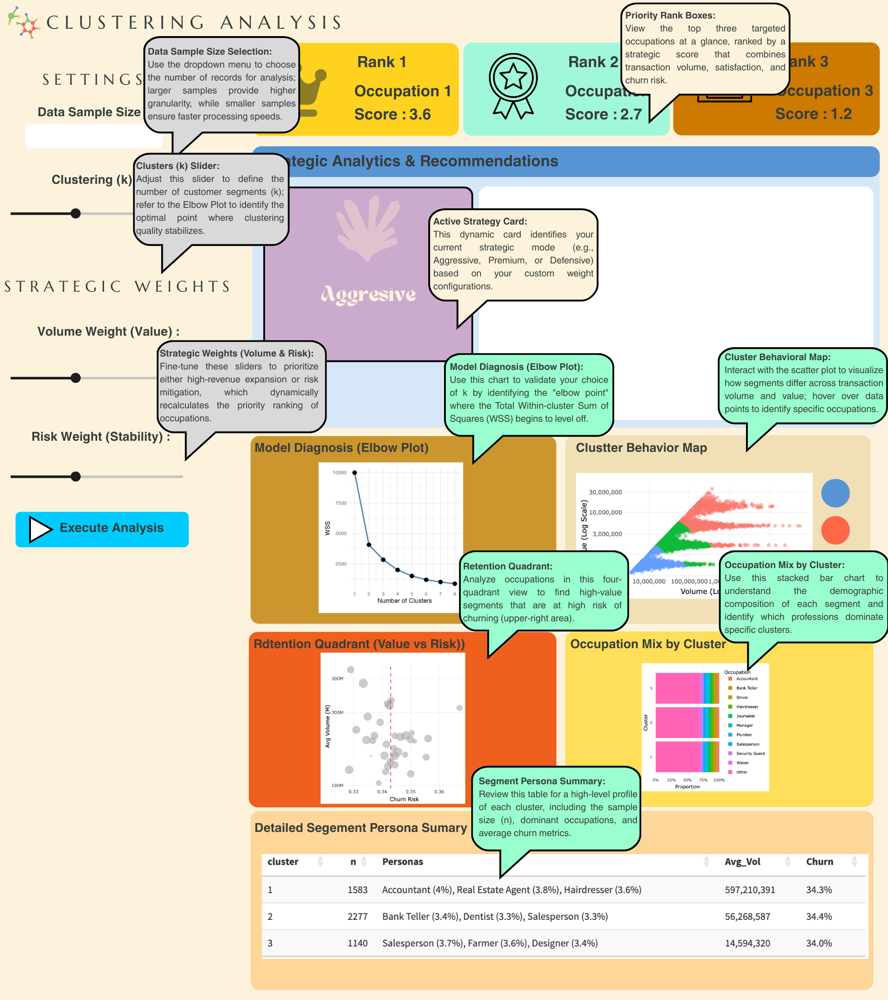

# **Load Packages and Data**

Check and load packages, ensuring they are sourced from and supported by CRAN.

```{r}
#| message: false
#| warning: false
pacman::p_load(tidyverse, scales, knitr,tidymodels,fpc)
df_raw <- read_csv("data/colombia_customers_processed.csv")
```

# **Data Processing**

-   We apply log10​ transformation to handle the long-tail distribution of transaction data, compressing outliers and normalizing the scale. This ensures the model captures behavioral trends more effectively without being distorted by extreme values.

-   To account for scale differences between value and volume, we normalize features to a mean of 0 and SD of 1. This eliminates unit bias, ensuring each metric carries equal weight in the clustering process.

```{r}
df_for_clustering <- df_raw %>%
  dplyr::select(customer_id, average_transaction_value, total_transaction_volume) %>%
  mutate(
    log_avg_value = log10(average_transaction_value + 1),
    log_total_vol = log10(total_transaction_volume + 1)
  )
cluster_recipe <- recipe(~ log_avg_value + log_total_vol, data = df_for_clustering) %>%
  step_normalize(all_predictors()) %>%
  prep()
df_cleaned <- bake(cluster_recipe, new_data = NULL)
summary(df_cleaned)
```

# **Feature Selection**

By selecting core transactional metrics, psychological traits (satisfaction, churn), and demographics, while applying log transformations to skewed values, we build a more precise and holistic customer profile. This streamlines model inputs for better performance while enhancing the ability to capture complex behavioral patterns.

```{r}
#| message: false
#| warning: false
df_for_analysis <- df_raw %>% 
  dplyr::select(
    customer_id, 
    total_transaction_volume, 
    average_transaction_value, 
    satisfaction_score, 
    churn_probability, 
    gender, 
    income_bracket
  ) %>% 
  mutate(
    log_total_vol = log10(total_transaction_volume + 1),
    log_avg_value = log10(average_transaction_value + 1)
  )
```

# **Data Validation & Cleaning**

```{r}
# ensure no missing values
colSums(is.na(df_for_analysis))
```

# **Representative Sampling**

By setting a random seed and sampling 5,000 records, we significantly enhance computational efficiency while maintaining data representativeness. This reduces processing time for visualization and modeling while ensuring that the analysis remains consistent and reproducible across different runs.

```{r}
set.seed(123) 
df_sampled <- df_for_analysis %>%
  sample_n(5000) 
```

# **Elbow Plot**

We iteratively evaluate k values from 1 to 10 and visualize the "Total Within-cluster Sum of Squares" through an Elbow Plot. This helps balance model complexity and precision, allowing us to mathematically identify the "elbow point" where improvements level off, ensuring we select the most meaningful number of clusters.

```{r}
#| message: false
#| warning: false
set.seed(123)
kclusts <- tibble(k = 1:10) %>%
  mutate(
    kmean = map(k, ~kmeans(df_cleaned, .x, nstart = 20)),
    glanced = map(kmean, glance)
  ) %>%
  unnest(glanced)

ggplot(kclusts, aes(k, tot.withinss)) +
  geom_line(size = 1, color = "steelblue") +
  geom_point(size = 3, color = "steelblue") +
  scale_x_continuous(breaks = 1:10) +
  theme_minimal() +
  labs(title = "Elbow Plot for K-means",
       x = "Number of Clusters (k)",
       y = "Total Within-cluster Sum of Squares")
```

# **Model Selection**

```{r}
#| include: false
df_cleaned_5000 <- bake(cluster_recipe, new_data = df_sampled)
cf_boot <- clusterboot(df_cleaned_5000, 
                       clustermethod = kmeansCBI, 
                       krange = 3, 
                       seed = 123)
```

```{r}
print(cf_boot$bootmean)
```

# **Clustering Analysis Dashboard**

We aggregate key metrics—transaction volume, value, and churn risk—to construct a behavioral profile for each segment. This visualization highlights the unique characteristics of each group, enabling us to translate abstract data clusters into actionable business personas and targeted strategies.

```{r}
set.seed(123)
final_kmeans <- kmeans(df_cleaned_5000, centers = 3, nstart = 25)
df_final_results <- df_sampled %>% 
  mutate(cluster = as.factor(final_kmeans$cluster))
df_final_results %>%
  group_by(cluster) %>%
  summarise(
    Across_Vol = mean(log_total_vol),
    Across_Avg = mean(log_avg_value),
    Across_Churn = mean(churn_probability, na.rm = TRUE)
  ) %>%
  pivot_longer(-cluster, names_to = "Metric", values_to = "Score") %>%
  ggplot(aes(x = Metric, y = Score, color = cluster, group = cluster)) +
  geom_line(size = 1.2) +
  geom_point(size = 3) +
  theme_minimal() +
  labs(title = "Cluster Behavioral", subtitle = "Standardized metrics for cross-segment feature comparison")
```

```{r}
df_for_analysis <- df_raw %>% 
  dplyr::select(
    customer_id, 
    total_transaction_volume, 
    average_transaction_value, 
    satisfaction_score, 
    churn_probability, 
    occupation,     
    gender,         
    age_group      
  ) %>% 
  mutate(
    log_total_vol = log10(total_transaction_volume + 1),
    log_avg_value = log10(average_transaction_value + 1)
  )

set.seed(123)
df_sampled <- df_for_analysis %>% sample_n(min(5000, n()))

df_cleaned_5000 <- bake(cluster_recipe, new_data = df_sampled)
set.seed(123)
final_kmeans <- kmeans(df_cleaned_5000, centers = 3, nstart = 25)
df_final_results <- df_sampled %>%
  mutate(cluster = as.factor(final_kmeans$cluster))
p_occupation <- df_final_results %>%
  filter(!is.na(occupation)) %>% 
  mutate(occupation = fct_lump(occupation, n = 10)) %>% 
  ggplot(aes(x = cluster, fill = occupation)) + 
  geom_bar(position = "fill") +
  scale_y_continuous(labels = scales::label_percent()) + 
  coord_flip() +
  labs(
    title = "Occupation Composition Analysis by Cluster", 
    x = "Cluster", 
    y = "Proportion", 
    fill = "Occupations"
  ) +
  theme_minimal()

print(p_occupation)
```

```{r}
df_final_results %>%
  group_by(cluster) %>%
  summarise(
    n = n(),
    avg_vol = mean(total_transaction_volume, na.rm = TRUE),
    avg_churn = mean(churn_probability, na.rm = TRUE),
    avg_sat = mean(satisfaction_score, na.rm = TRUE)
  )
```

```{r}
get_top_n_labels <- function(v, n = 3) {
  v <- na.omit(v)
  if (length(v) == 0) return("None")
  total_count <- length(v)
  top_n <- as.data.frame(table(v)) %>%
    rename(Occupation = v) %>%
    arrange(desc(Freq)) %>%
    slice_head(n = n) %>%
    mutate(label = paste0(Occupation, " (", round(Freq / total_count * 100, 1), "%)"))
  
  paste(top_n$label, collapse = ", ")
}
persona_summary_pro <- df_final_results %>%
  group_by(cluster) %>%
  summarise(
    n = n(),
    Top_3_Occupations = get_top_n_labels(occupation, n = 3),
    Avg_Volume = round(mean(total_transaction_volume, na.rm = TRUE), 0),
    Avg_Churn = round(mean(churn_probability, na.rm = TRUE), 2)
  )
print(persona_summary_pro)
```

-   **Segment 1 \| The High-Volume Core (**n=2,276): Comprising the largest portion of our sample, this group features stable professionals like **Bank Tellers and Dentists**. They represent our most reliable revenue stream with high transaction volumes.

-   **Segment 2 \| Premier High-Earners (**n=1,583): This elite group, dominated by **Accountants and Real Estate Agents**, yields the highest average transaction volume (\~59.7M). They are the prime targets for premium loyalty programs and high-tier financial products.

-   **Segment 3 \| Emerging Budget Segment (**n=1,141): Consisting of **Salespeople, Farmers, and Designers**, this group exhibits lower transaction volumes (\~14.6M). These customers may benefit from growth-oriented micro-services or entry-level financial tools.

# Mapping R Parameters to Shiny UI Components

## Mapping Table

|  |  |  |  |
|----|----|----|----|
| **Module** | **Parameter** | **Shiny UI Input** | **Description** |
| **Data Control** | `sample_size` | `selectInput()` | Allows users to choose data subsets (5k, 10k, 20k) to optimize server performance vs. analysis depth. |
| **Data Control** | `run_analysis` | `actionButton()` | Employs **event-driven reactivity** to trigger heavy K-means calculations only when requested, saving computational resources. |
| **K-means Model** | `k_val` | `sliderInput()` | Dynamically adjusts the number of clusters ($k$) to explore different levels of customer segmentation granularity. |
| **Strategic Logic** | `w_vol` | `sliderInput()` | Adjusts the weight of **Transaction Volume** in the priority algorithm to focus on revenue-heavy segments. |
| **Strategic Logic** | `w_risk` | `sliderInput()` | Adjusts the weight of **Churn Probability** to prioritize defensive strategies for at-risk segments. |
| **Visual Analytics** | `cluster_scatter` | `plotlyOutput()` | Visualizes behavioral distances using **log-transformed** axes to handle skewed transaction distributions. |
| **Strategic Output** | `priority_boxes` | `uiOutput()` | Renders dynamic Rank Cards (Gold, Silver, Bronze) based on a weighted scoring of Volume, Satisfaction, and Risk. |
| **Strategic Output** | `persona_table` | `DTOutput()` | Provides a high-level summary of cluster personas, including the "Top 3 Occupations" and average churn metrics. |

## User Input Parameters (Inputs)

|  |  |  |
|----|----|----|
| **Parameter Name** | **UI Input ID** | **Description** |
| **Data Sample Size** | `sample_size` | Allows users to choose between 5k, 10k, or 20k records to balance performance and granularity. |
| **Number of Clusters (**$k$) | `k_val` | A slider to dynamically adjust the K-means $k$ parameter (Range: 2–8). |
| **Strategic Weights** | `w_vol`, `w_risk` | Sliders (0–1) that allow users to prioritize transaction volume vs. churn risk in the ranking logic. |
| **Execution Trigger** | `run_analysis` | An action button that prevents unnecessary re-calculations until the user is ready. |

## Visual & Data Outputs (Outputs)

|  |  |  |
|----|----|----|
| **Output Name** | **UI Output ID** | **Description** |
| **Priority InfoBoxes** | `priority_boxes` | Top 3 ranked occupations based on the weighted strategic score (Gold, Silver, Bronze). |
| **Strategy Card** | `active_strategy_card` | A dynamic UI element that identifies the "Strategy Mode" (e.g., Premium, Defensive). |
| **Elbow Plot** | `elbow_plot` | A static ggplot diagnostic tool to help users identify the optimal $k$. |
| **Behavioral Map** | `cluster_scatter` | An interactive Plotly scatter plot showing the clusters in log-scale. |
| **Retention Quadrant** | `quadrant_plot` | A Plotly bubble chart mapping churn risk against transaction volume. |
| **Segment Summary** | `persona_table` | A DT table summarizing the Top 3 occupations and key metrics per cluster. |

## User Interface (UI) Selection Rationale Table

|  |  |  |
|----|----|----|
| **Parameter** | **UI Component** | **Rationale** |
| **Data Sample Size** | `selectInput()` | Ideal for providing a discrete list of optimized choices (5k, 10k, 20k). This prevents users from entering arbitrary large numbers that could crash the Shiny server. |
| **Clusters (**$k$) | `sliderInput()` | Enables intuitive exploration of model granularity. The sliding mechanism allows users to "feel" the transition between different cluster counts while observing the Elbow Plot. |
| **Strategic Weights** | `sliderInput()` | Uses a step of 0.1 to allow precise "tuning" of the business strategy. This provides a tactile way for managers to balance the trade-off between Volume and Risk. |
| **Execute Analysis** | `actionButton()` | **Critical for Event Reactivity.** Since K-means and scoring calculations are computationally expensive, this ensures the app only updates once all parameters are finalized. |
| **Strategic Rankings** | `infoBox()` | Leveraging **Visual Hierarchy**, these boxes use semantic colors (Gold, Silver, Bronze) and icons to provide immediate, high-level insights for decision-makers. |
| **Behavioral Maps** | `plotlyOutput()` | Unlike static plots, Plotly allows for **Hover Interactivity**, enabling users to identify specific "Occupations" behind the data points for better persona validation. |
| **Persona Summary** | `DTOutput()` | Chosen for its built-in search and pagination. It allows users to drill down into cluster-specific metrics without overwhelming the dashboard's visual real-time space. |
| **Navigation** | `dashboardSidebar()` | Provides a **Separation of Concerns** by isolating control settings and high-level navigation from the main analytical workspace, reducing cognitive load. |

# UI Design (Storyboard)

The storyboard outlines the user journey and the spatial organization of the "Clustering Analysis Dashboard."

## The Control Center (Sidebar)

-   **Parameter Tuning:** The sidebar serves as the primary navigation and configuration hub, where users define the scope of analysis via sample size and cluster counts.

-   **Strategic Weighting:** Users can interactively shift the dashboard's focus between revenue (Volume) and stability (Risk) using intuitive sliders, allowing for real-time strategy simulation.

## **Executive Summary (Top Tier)**

-   **Priority Ranking:** At the top of the page, high-impact segments are immediately highlighted using Gold, Silver, and Bronze Rank cards to guide rapid decision-making.

-   **Strategic Guidance:** The central recommendation panel translates complex cluster metrics into plain-English managerial actions based on the active strategy mode.

## **Analytical Deep-Dive (Middle & Bottom Tier)**

-   **Diagnostic & Distribution:** The middle tier provides the technical foundation, showing the mathematical validity of the clusters and their distribution in the behavioral space.

-   **Composition & Persona:** The final tier decomposes clusters by occupation and displays a detailed summary table to provide the "human" context behind the numbers.



# Selection of Visualisation Techniques & Design Principles

This section outlines the strategic choice of visual elements and the underlying design principles applied to ensure the dashboard provides actionable insights for business stakeholders.

## **1. Model Diagnosis (Elbow Plot)**

-   **Technique:** Line Chart with point markers.

-   **Purpose:** To assist users in mathematically determining the optimal number of clusters (k) by identifying the "elbow point" where the Total Within-cluster Sum of Squares (WSS) stabilizes.

## **2. Behavioral Map (Scatter Plot)**

-   **Technique:** Interactive Scatter Plot with Log-Log scaling.

-   **Purpose:** To visualize the behavioral distance between clusters while handling the extreme skewness of transaction data through log transformation.

## **3. Retention Quadrant (Value vs. Risk)**

-   **Technique:** 4-Quadrant Bubble Chart.

-   **Purpose:** To facilitate strategic positioning by mapping occupations based on their average transaction volume and churn probability, highlighting high-priority "at-risk" segments.

## **4. Occupation Mix (Stacked Bar Chart)**

-   **Technique:** 100% Stacked Bar Chart with `fct_lump`.

-   **Purpose:** To analyze the demographic composition of each cluster, allowing users to identify if a segment is dominated by a specific profession or is more diversified.
