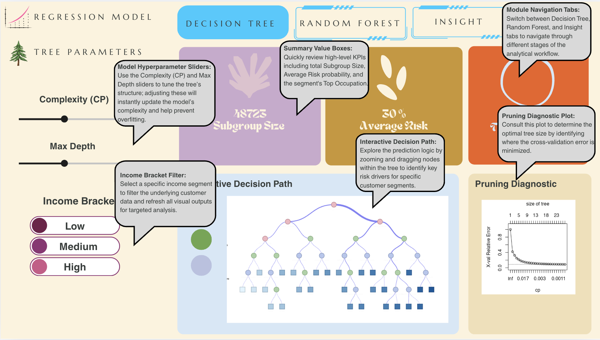
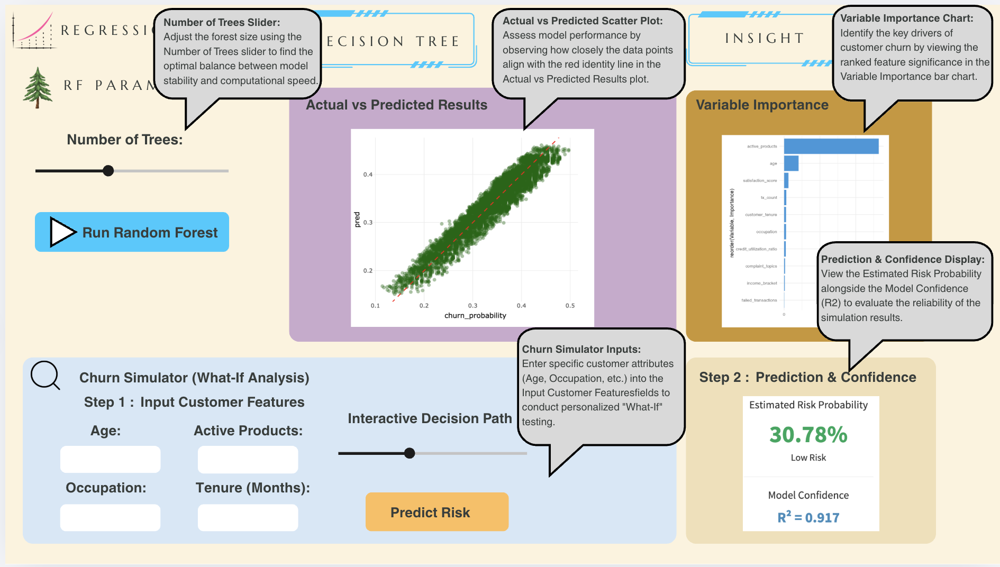
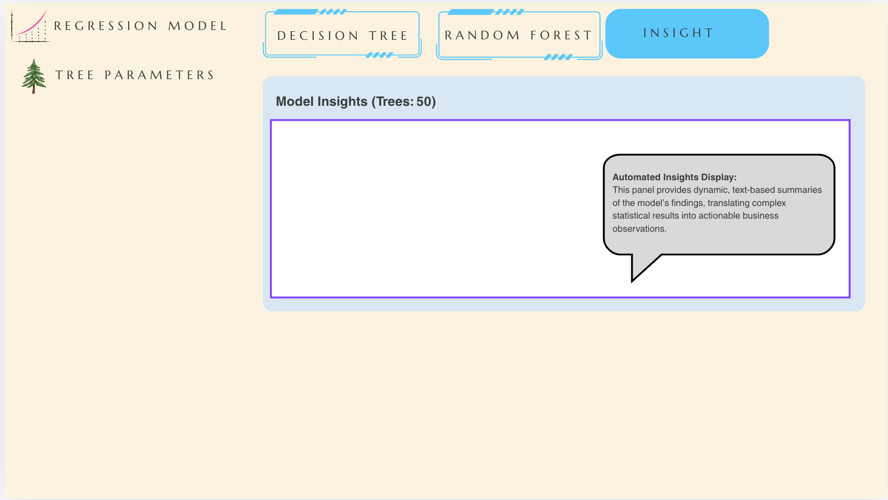

# **Load Packages and Data**

Check and load packages, ensuring they are sourced from and supported by CRAN.

```{r}
pacman::p_load(tidyverse, rpart, rpart.plot, sparkline, visNetwork, 
               caret, ranger, patchwork, randomForest)
df <- read.csv("data/colombia_customers_processed.csv") %>%
  select(
    churn_probability,      
    age,                    
    location, 
    income_bracket,
    active_products,        
    tx_count,                
    customer_tenure,         
    failed_transactions,     
    credit_utilization_ratio,
    satisfaction_score,      
    complaint_topics        
  ) %>%
  mutate(across(where(is.character), as.factor))
```

# **Regression Tree**

### **Basic Regression Tree model**

```{r}
anova.model <- function(min_split, complexity_parameter, max_depth) {
  rpart(churn_probability ~ ., 
        data = df,          
        method = "anova", 
        control = rpart.control(minsplit = min_split, 
                                cp = complexity_parameter, 
                                maxdepth = max_depth))
}
fit_tree <- anova.model(5, 0.001, 10)
```

### **Visualising the Regression Tree**

```{r}
visTree(fit_tree, edgesFontSize = 14, nodesFontSize = 16, width = "100%")
```

```{r}
#| message: false
#| warning: false
printcp(fit_tree)
```

```{r}
bestcp <- fit_tree$cptable[which.min(fit_tree$cptable[,"xerror"]), "CP"]
pruned_tree <- prune(fit_tree, cp = bestcp)
visTree(pruned_tree, 
        edgesFontSize = 14, 
        nodesFontSize = 16, 
        width = "100%",
        main = "Pruned Customer Churn Prediction Tree (Optimized)",
        submain = paste("Best CP value:", round(bestcp, 4)),      
        colorY = c("#E1F5FE", "#01579B")) 
```

# **Random Forest**

### **Splitting of data set into train vs. test data**

```{r}
set.seed(1234)
trainIndex <- createDataPartition(df$churn_probability, 
                                  p = 0.8,      
                                  list = FALSE, 
                                  times = 1)
df_train <- df[trainIndex, ]  
df_test  <- df[-trainIndex, ]
```

### **Hyperparameter Tuning and Training of Model**

```{r}
#| message: false
#| warning: false
#| results: 'hide'
repeatcvControl <- trainControl(
  method = "repeatedcv",
  number = 10,
  repeats = 3,          
  verboseIter = TRUE     
)

n_features <- ncol(df_train) - 1      
my_mtry <- floor(sqrt(n_features))  

rf_model <- train(
  churn_probability ~ .,            
  data = df_train,
  method = "ranger", 
  trControl = repeatcvControl, 
  num.trees = 50,                  
  importance = "impurity", 
  tuneGrid = data.frame(
    mtry = my_mtry, 
    min.node.size = 5,
    splitrule = "variance"
  )
)
```

```{r}
#| message: false
#| warning: false
df_test$fit_forest <- predict(rf_model, df_test)
test_r2 <- cor(df_test$churn_probability, df_test$fit_forest)^2
rf_scatter <- ggplot(data = df_test, aes(x = churn_probability, y = fit_forest)) + 
  geom_point(alpha = 0.4, color = "darkgreen") +
  geom_abline(slope = 1, intercept = 0, color = "red", linetype = "dashed") +
  labs(x = "Actual Churn Probability", 
       y = "Predicted Churn Probability",
       title = paste0("Test R-squared: ", round(test_r2, digits = 3))) + 
  theme_minimal() +
  theme(axis.text = element_text(size = 8),
        axis.title = element_text(size = 10),
        title = element_text(size = 10))
rf_residuals <- ggplot(data = df_test, aes(x = churn_probability, 
                                          y = (fit_forest - churn_probability))) + 
  geom_point(col = "blue3", alpha = 0.4) +
  labs(y = "Residuals (Error)", x = "Actual Churn Probability") + 
  geom_hline(yintercept = 0, col = "red4", linetype = "dashed", linewidth = 0.8) + 
  theme_minimal() +
  theme(axis.text = element_text(size = 8),
        axis.title = element_text(size = 10))

library(patchwork)
p <- rf_scatter + rf_residuals + 
  plot_annotation(title = "Model Performance Analysis: Churn Probability Prediction",
                  subtitle = "Left: Predicted vs Actual | Right: Residual Distribution",
                  theme = theme(plot.title = element_text(size = 16, face = "bold")))

p
```

```{r}
#| message: false
#| warning: false
varImp(rf_model)
```

```{r}
#| message: false
#| warning: false
trctrl_none <- trainControl(method = "none") 
tree_range <- seq(10, 200, by = 10)
rsquared_trees <- c()
my_mtry <- floor(sqrt(ncol(df_train) - 1))
for (i in tree_range){
  rf_tmp <- train(
    churn_probability ~ ., 
    data = df_train,
    method = "ranger", 
    trControl = trctrl_none, 
    num.trees = i,
    importance = "impurity", 
    tuneGrid = data.frame(mtry = my_mtry, min.node.size = 5, splitrule = "variance")
  )
  rsquared_trees <- append(rsquared_trees, rf_tmp$finalModel$r.squared)
}
rsquared_plot <- data.frame(tree_range, rsquared_trees)

ggplot(rsquared_plot, aes(x = tree_range, y = rsquared_trees)) + 
  geom_line(color = "#2c3e50", linewidth = 1.2) + 
  geom_point(color = "#e74c3c", size = 3) + 
  labs(
    x = "Number of Trees", 
    y = "OOB R-squared Value",
    title = "Random Forest Hyperparameter Optimization",
    subtitle = "Analysis of model accuracy vs. computational cost (number of trees)",
    caption = "Data: Colombia Customer Churn Dataset"
  ) +
  theme_minimal() +
  theme(plot.title = element_text(face = "bold", size = 14))
```

# Mapping R Parameters to Shiny UI Components

## Mapping Table

|  |  |  |  |
|------------------|------------------|------------------|------------------|
| **Module** | **Parameter** | **Shiny UI Input** | **Description** |
| **Global Filter** | `income_bracket` | `selectInput()` | Allow users to filter specific income groups to enable localized model analysis. |
| **Decision Tree** | `cp` (Complexity) | `sliderInput()` | Dynamically adjust pruning parameters to balance model overfitting and underfitting. |
| **Decision Tree** | `max_depth` | `sliderInput()` | Limit the maximum tree depth to ensure interactive visualizations remain clean and readable. |
| **Random Forest** | `num_trees` | `sliderInput()` | Adjust the number of trees in the forest to observe changes in model stability and R2 values. |
| **Random Forest** | `run_rf` | `actionButton()` | Reduce server computational load by using action buttons for event-driven reactivity. |
| **What-If Simulator** | `age`, `tenure`, etc. | `numericInput()` & `sliderInput()` | Enable users to input specific customer features for real-time churn risk prediction. |
| **What-If Simulator** | `predict_sim` | `actionButton()` | Trigger Random Forest model inference on a single test sample. |

## Expected Outputs

|  |  |  |  |
|------------------|------------------|------------------|------------------|
| **Output** | **R package** | **Shiny UI Output** | **Description** |
| **Summary Stats** | `valueBox()` | `valueBoxOutput()` | Displays summary statistics for the selected subgroup, including **sample size**, **average risk probability**, and **top occupations**. |
| **Interactive Tree** | `visNetwork` | `visNetworkOutput()` | Provides an **interactive decision path diagram** with **zoom and click functionalities** for granular exploration. |
| **Diagnostics** | `plotcp()` | `plotOutput()` | Visualizes the **Complexity Parameter (CP) plot** to assist users in identifying the **optimal pruning point** to prevent overfitting. |
| **Performance** | `plotly` | `plotlyOutput()` | Generates an **interactive scatter plot** comparing **predicted values vs. actual observations** to evaluate model fit. |
| **Variable Imp.** | `ggplot2` | `plotOutput()` | Presents the **variable importance ranking** to highlight the most significant drivers of customer churn. |
| **Automated Text** | `renderUI()` | `uiOutput()` | Automatically generates **dynamic textual insights** and interpretations based on real-time model execution results. |

## UI Selection Rationale Table

|  |  |  |
|------------------------|------------------------|------------------------|
| **Parameter** | **UI Component** | **Rationale** |
| **Complexity (CP)** | `sliderInput()` | Allows users to fine-tune the pruning threshold within a specific range with immediate visual feedback. |
| **Max Depth** | `sliderInput()` | Best for constrained integer ranges, preventing users from entering values that might cause computational lag. |
| **Income Bracket** | `selectInput()` | Ideal for categorical data, providing a clean dropdown list for users to select specific customer segments. |
| **Number of Trees** | `sliderInput()` | Uses a step of 10 to balance model stability and processing time, ensuring a smooth user experience. |
| **Occupation** | `selectInput()` | Since there are multiple categories, a dropdown menu saves sidebar space compared to radio buttons. |
| **Run RF** | `actionButton()` | Essential for heavy computations; it prevents the app from recalculating every time a single parameter changes (Event Reactivity). |

# UI Design (Storyboard)

The following storyboards illustrate the interactive layout of the three main modules. Each component is optimized to guide users from technical parameter tuning to actionable business insights.

## Module 1: Decision Tree Analysis



This module focuses on transparency, allowing users to trace the logic of customer churn through an interactive tree.

-   **Logic Path Discovery:** Users can manipulate hyperparameters to see how the tree structure adapts in real-time.

-   **Segment Health:** High-level KPIs provide immediate context for the filtered customer subgroup.

## Module 2: Random Forest & What-If Simulator



This module provides a more robust predictive engine and a sandbox environment for individual risk assessment.

-   **Model Confidence:** By comparing actual vs. predicted results, users can verify the model's reliability (R2) before making decisions.

-   **Predictive Simulation:** The "What-If" area allows front-line staff to input specific customer profiles and receive instant risk scores.

## Module 3: Automated Insights



The final module bridges the gap between complex machine learning outputs and business interpretation.

-   **Dynamic Interpretation:** Instead of just showing numbers, this panel generates automated text summaries that highlight the most significant churn drivers based on the current model run.

# **Selection of Visualisation Techniques & Design Principles**

This section outlines the design choices and interactivity principles implemented to ensure an effective user experience for clustering analysis:

-   **Strategic Prioritization (infoBox & uiOutput):** High-level rankings (Gold, Silver, Bronze) are placed at the top of the dashboard. This follows the **"Overview First"** design pattern, providing immediate situational awareness of the most critical customer segments before users dive into technical details.

<!-- -->

-   **Cluster Diagnosis (Elbow Plot):** A line chart with point markers is used to visualize the Total Within-cluster Sum of Squares (WSS). This ensures **"Model Transparency,"** allowing users to mathematically justify and validate the selection of the cluster count (k).

-   **Behavioral Mapping (Scatter Plot & plotly):** An interactive scatter plot with **Log-Log scaling** is used to handle highly skewed transaction data. Integrating `plotly` supports the **"Details-on-Demand"** principle, where users can hover over data points to identify specific occupations within each cluster.

-   **Strategic Positioning (Retention Quadrant):** A 4-quadrant bubble chart maps average volume against churn risk. This enables **"Actionable Insights,"** helping stakeholders visually categorize occupations into "High-Value/High-Risk" quadrants for prioritized intervention.

-   **Demographic Composition (Stacked Bar Chart):** A 100% stacked bar chart provides a clear view of cluster makeup. By applying `fct_lump` to handle high-cardinality occupations, the design reduces **"Cognitive Overload,"** ensuring the most dominant segments are easily identifiable.

-   **Performance Optimization (Event Reactivity):** To ensure a responsive UX, `actionButton()` and `eventReactive()`are used for K-means computations. This implements **"Execution Control,"** preventing server lag by ensuring heavy analytical calculations only occur when the user is ready.
