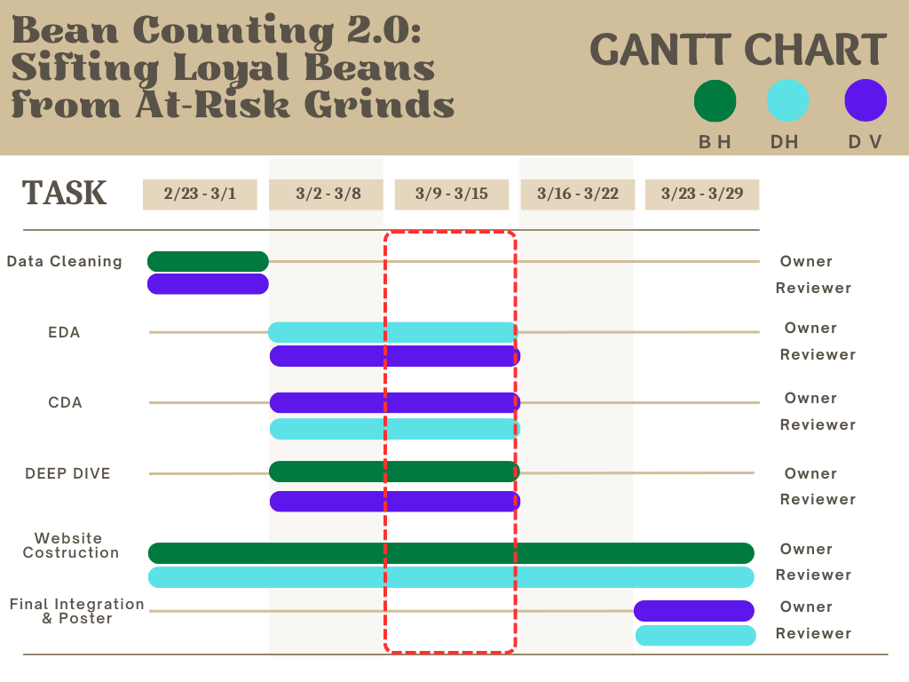

# Overview

This project utilizes the **"Banking Customer Churn and Satisfaction Dataset (Colombia)"** sourced from **Mendeley Data**. The dataset is specifically curated to study the intricate relationships between customer satisfaction, service engagement, and churn behavior within the Colombian financial landscape.

The data spans across major Colombian economic hubs, including **Bogotá (Cundinamarca)**, **Medellín (Antioquia)**, **Pereira (Risaralda)**, and other departments, offering a diverse demographic and socio-economic snapshot.

The dataset **Colombian Fintech Financial Analytics Dataset** comprises over 50 variables categorized into four key dimensions:

-   **Demographics & Socio-economics**: Age, gender, education level, occupation, and `income_bracket`.

-   **Engagement & Product Usage**: Ownership of credit cards, personal loans, insurance, and digital metrics such as `app_logins_frequency`.

-   **Transactional Behavior**: Including `total_tx_volume`, `transaction_frequency`, and specific patterns like `weekend_transaction_ratio`.

-   **Satisfaction & Predictive Metrics**: Multi-dimensional scores (Product, Transaction, NPS) and the critical target variables: **`churn_probability`** and **`customer_lifetime_value` (CLV)**.

# Motivation

In the fiercely competitive Colombian financial landscape, traditional static reporting is no longer sufficient to navigate the complexities of customer attrition. This project is driven by the imperative to transform raw, fragmented transactional and behavioral data into a high-fidelity interactive analytical platform. By integrating rigorous data preparation, multi-dimensional clustering, and interpretable decision-making models, we aim to bridge the critical gap between data collection and strategic intervention. Our motivation lies in empowering banking stakeholders to move beyond intuition, enabling them to proactively identify at-risk segments and deploy precise retention strategies that convert complex behavioral patterns into a sustainable competitive advantage.

# Problem Statement

-   **Data Complexity & Raw Formats**: The raw dataset contains categorical variables and inconsistent date formats that require significant preprocessing before they can be used for modeling.

-   **Undifferentiated Customer Base**: Without a scientific clustering approach, it is difficult for the bank to distinguish between "High-Value Loyalists," "Occasional Users," and "At-Risk Sleepers."

-   **Opacity of Churn Drivers**: While the bank may observe a rise in churn, the specific combination of behaviors (e.g., declining app usage paired with high support requests) remains unclear without a predictive logic model.

# R Package

|  |  |  |
|------------------------|------------------------|------------------------|
| **Category** | **R Packages** | **Specific Application** |
| **Data Wrangling & Core** | `tidyverse`, `lubridate` | Cleaning Colombian customer records and utilizing `lubridate` to process `first_tx` and `last_tx` for calculating **Customer Tenure**. |
| **Interactive EDA** | `plotly`, `ExPanDaR`, `scales` | Creating dynamic distributions for `income_bracket` and `churn_probability`; implementing automated exploratory data analysis and data scaling. |
| **Confirmatory Data Analysis (CDA)** | `ggstatsplot`, `corrplot` | Executing rigorous statistical tests, such as using **ANOVA** to verify if satisfaction scores differ significantly across occupations, and visualizing correlation matrices. |
| **Machine Learning & Clustering** | `tidymodels`, `fpc`, `caret` | Developing machine learning workflows. Utilizing `fpc` for **K-means clustering** to segment customers into "High-Value Beans" or "At-Risk Grinds." |
| **Decision Tree & Prediction** | `rpart`, `rpart.plot`, `randomForest`, `ranger` | Constructing churn prediction models to identify critical attrition drivers and numerical thresholds (e.g., specific drop in App login frequency). |
| **UI & Visualization Enhancement** | `visNetwork`, `sparkline`, `patchwork` | Embedding `sparklines` for transaction trends within the dashboard; using `visNetwork` for interactive decision paths; and `patchwork` for multi-paneled visualizations. |
| **Reporting & Aesthetics** | `kableExtra`, `knitr` | Generating high-fidelity HTML tables for data summaries to ensure clarity and professional aesthetics in the final report. |

# Methodology

Our analytical approach focuses on three core modules designed to address the business challenges identified above:

## I. Exploratory Data Analysis 

-   **Rationale**: We utilize dynamic charts and geospatial visualizations to examine the distribution of customer attributes and identify preliminary correlations between variables.

-   **Benefit**: This allows management to quickly isolate anomalous behavior patterns in specific regions (e.g., Bogotá) or among users of specific products, establishing a foundation for deeper analysis.

## **II. Confirmatory Data Analysis (CDA)** 

-   **Rationale:** We apply inferential statistical tests (ANOVA, Chi-square, and Pearson Correlation) to validate whether the patterns observed in EDA are statistically significant or merely due to random chance.

-   **Benefit:** Provides a rigorous scientific basis for selecting features for downstream modeling, ensuring that the business strategies are built on statistically sound relationships (e.g., confirming if income truly impacts churn).

## III. Clustering Analysis

-   **Rationale**: We apply the **K-means algorithm** to scientifically categorize customers based on similar transactional behaviors, such as volume and frequency, ensuring high interpretability for business users without requiring complex dimensionality reduction.

-   **Benefit**: Enables the bank to implement differentiated marketing strategies—such as offering exclusive perks to high-value segments or promoting value-added products to active newcomers—thereby optimizing resource allocation.

## IV. Decision Tree Analysis

-   **Rationale**: We build a classification model targeting **`churn_probability`** to identify the most critical drivers of attrition and their specific numerical thresholds.

-   **Benefit**: This produces actionable "decision rules" (e.g., "If app logins drop below X, churn risk increases by Y%"), allowing operational teams to initiate immediate intervention based on clear early-warning indicators.

# GANTT CHART

